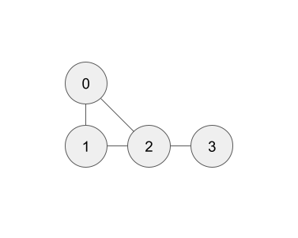
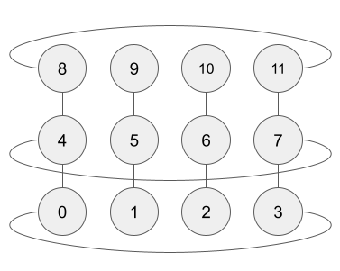
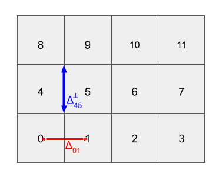

Grids
*****

There are many different types of grids used by ocean models, such as latitude-longitude grids, tiled rectilinear grids, triangular or hexagonal grids, and adaptive unstructured grids.  An observational campaign could have stations at arbitrary locations.

``neutralocean`` can handle any dataset of vertical casts: you just have to specify which pairs of casts are adjacent.  We think of the horizontal grid as a `graph <https://en.wikipedia.org/wiki/Graph_(discrete_mathematics)>`_: a collection of nodes and edges.  Each node is a vertical cast (which could be ocean or land).  Two nodes are joined by an edge when the two vertical casts are adjacent.  

Example.  Suppose we took 4 casts from the ocean, with three in a triangle and a fourth off to the side (as in the ``4casts.py`` :ref:`installation:Test example`):

The nodes (vertical casts) are labelled ``0, 1, ... N-1``, where ``N`` is the number of casts (here ``N = 4``).  
The order doesn't really matter, but once it's chosen we then specify the edges (pairs of adjacent casts) as a list of length ``E`` (here ``E = 4``), with each element itself a 2-element list.  Here, ``edges = ((0, 1), (0, 2), (1, 2), (2, 3))``.

For a **rectilinear grid** (such as a lat-lon grid), most casts are adjacent to four other casts.  We can label the casts ``0, 1, ..., N-1`` starting in the south-west and going first across longitudes and then across latitudes, ending in the north-east.  The order doesn't really matter, but must be specified.  

Example.  A 4 x 3 grid with ``N = 12`` that is periodic in longitude (x-axis) but not in latitude (y-axis):

.. note:: 

	The order of casts is determined by your data is stored in memory.  Suppose Salinity and Temperature are presented as 3D arrays of size ``(nj,ni,nk)``, which are the number of grid points in the latitudinal, longitudinal, and vertical dimensions, respectively.  The data is actually stored in memory as a long 1D array with the first ``nk`` elements being data from the "first" cast, the next ``nk`` elements being data from the "second" cast, etc.  This orders the casts.  Ideally, the vertical dimension is last (varying fastest in memory); if not, you can use the ``vert_dim`` argument and ``neutralocean`` will internally reorder your data to be so.

The pairs of adjacent casts are encoded as

.. code-block:: python

	edges = (
	    (0, 1), (1,  2), ( 2,  3), ( 3, 0),  # 1st row of connections
	    (4, 5), (5,  6), ( 6,  7), ( 7, 4),  # 2nd row of connections
	    (8, 9), (9, 10), (10, 11), (11, 8),  # 3rd row of connections
	    (0, 4), (1,  5), ( 2,  6), ( 3, 7),  # 1st column of connections
	    (4, 8), (5,  9), ( 6, 10), ( 7,11),  # 2nd column of connections
    )

If the grid also gives geometric information, we should give it to ``neutralocean``.  
If casts *m* and *n* are adjacent, 
let :math:`\Delta_{m,n}` be the distance between cell centers of casts *m* and *n*, and 
let :math:`\Delta^\perp_{m,n}` be the distance of the *face* between the cells of casts *m* and *n*.
This geometric information is encoded as two ``E``-length lists, ``dist`` and ``distperp`` respectively, given in the same order as ``edges``.  E.g. ``dist[i]`` is the distance between casts ``edges[i][0]`` and ``edges[i][1]``.  
This geometry for the 4x3 example can be illustrated as follows (not showing all geometric info):

The lists ``edges``, ``dist``, and ``distperp`` are passed to ``neutralocean`` as a ``dict`` named ``grid`` (see :ref:`potdens_surf` for its docstring).  

To ease building these lists, we provide ``build_grid`` functions for various grid types.  
See :ref:`the Grids API<API:Grids>`.  
For the first generic graph example, we'd use ``neutralocean.grids.graph.build_grid``.

For the lat-lon example, we'd use ``neutralocean.grids.rectilinear.build_grid``.  See :ref:`examples:OCCA` for an example.

A close cousin of rectilinear grids (like lat-lon) is a **tiled rectilinear grid**, in which there are several (square) rectilinear grids that are placed next to each other, such as the `lat-lon-cap <https://ecco-v4-python-tutorial.readthedocs.io/fields.html#tile-native-lat-lon-cap-90-grid>`_ used by ECCOv4r4.  For these grids, use ``neutralocean.grids.xgcm.build_grid`` to build the ``grid`` dict.  This uses `xgcm <https://xgcm.readthedocs.io/>`_ to handle the tiling, with `face connections <https://xgcm.readthedocs.io/en/latest/grid_topology.html>`_ specified in the xgcm way.  See :ref:`examples:ECCOv4` for an example.
